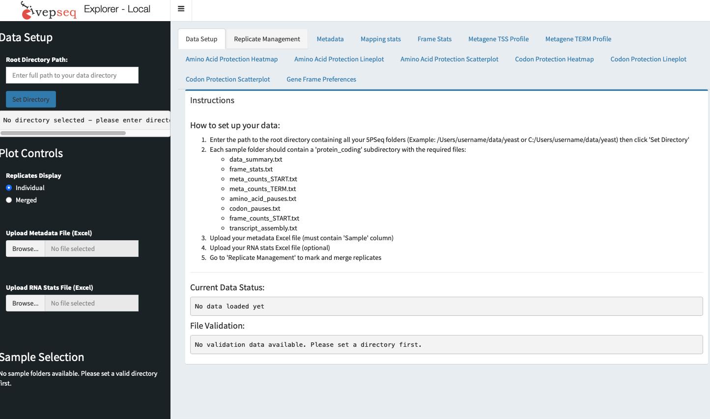

# Installation

5PSeq Explorer was written in R and is hosted on ScilifeLab Serve. This application runs entirely inside a Docker container.

## Requirements
- Docker

## Quick start

1. **Install Docker Desktop**  
   Windows & Mac: https://www.docker.com/products/docker-desktop/

2. **Open PowerShell or Command Prompt (Windows), or Terminal (Mac), and type:**

### Web version (with data hosted on our laboratory server)

```bash
docker pull stevensirene/fivepseq-explorer:v1.3
docker run -d -p 3838:3838 stevensirene/fivepseq-explorer:v1.3
```

### Plug-and-play 5PSeq Explorer-local version (please use with Data freeze- see Data)

```bash
docker pull stevensirene/5pseq-explorer-local:v1.0
docker run -d -p 3838:3838 stevensirene/5pseq-explorer-local:v1.0
```

3. **Open your browswer and go to:**

http://localhost:3838

4. **You should now see the 5PSeq Explorer interface**

 
